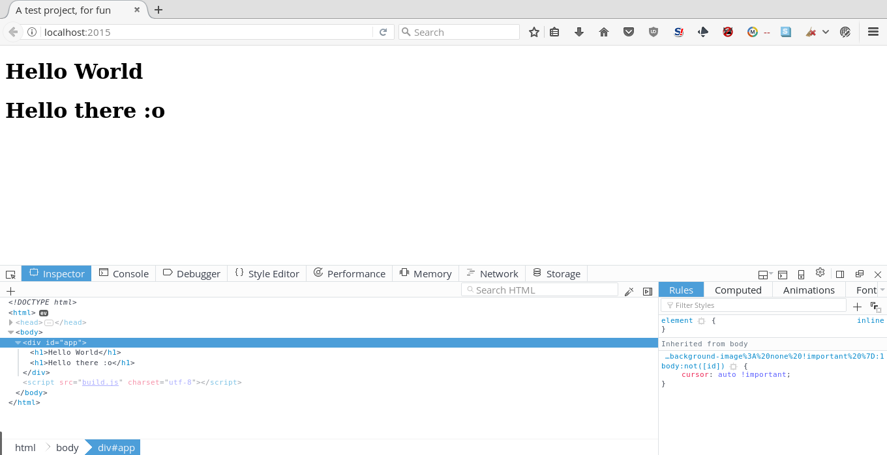

# Using Python to develop client-side applications

You might have heard that all the cool kids use JavaScript and many reactive programming libraries to develop client-side applications..

But had you ever imagined with the new advancements of Python in in-browser development, I usually now use Python instead of JavaScript because JavaScript's semantics give me cancer.

Hmm, getting to the point, I'm going to show you how to build a full-fledged TODO application that'll run on the browser.

## Setting up your environment

We are going to be using VueJS (**WARNING: I love that, you can also use others**) and Transcrypt (_I only like Brython and Transcrypt but Transcrypt's transcompiling seemed better for me than Brython, so I can use @Promise.coroutine_).

This should pretty much do all of this.

```bash
virtualenv3 webenv
source webenv/bin/activate
pip install transcrypt
mkdir todoapp
yarn init # You can also use NPM here
yarn add vue vue-router
mkdir src
```

## Making the boilerplate

### main.py
```Python
from url import fmap

Vue = require('vue')
VueRouter = require('vue-router')
Vue.use(VueRouter)

window.noop = lambda: False

ace = []
for p, h in fmap.items():
    ace.append({
        'path': p,
        'component': h,
    })
    pass

def init():
    router = __new__(VueRouter({
        'mode': 'history',
        'routes': ace,
    }))

    window.app = app = __new__(Vue({
        'router': router,
    }))

    app['$mount']('#app')
    pass

init()
```

### urls.py

```Python
from index import Index
fmap = {
  '/': Index(),
}
```

### index.py

```Python
def Index():
  return {
    'template': '<h1>Hello there :o</h1>',
    'data': (lambda: {})
  }
```

## Recap

How did that look? It's pretty darn close to JS, isn't it? Yes, that's true, it compiles to JS..

If you did all of it right, this should also work:

```bash
cd src
transcrypt -b -m -e 6 -n main.py
browserify -o ../build.js __javascript__/main.js
```

### index.html

```html
<!DOCTYPE html>
<html>
  <head>
    <meta charset="utf-8">
    <title>A test project, for fun</title>
  </head>
  <body>
    <div id="app"></div>
    <script src="build.js" charset="utf-8"></script>
  </body>
</html>
```

Hmm, noice, isn't it? You can serve it up in any dev. webserver, I personally like Caddy, so I'd just do:

`caddy`

And magically fire up localhost:2015, bam, a boilerplate for reactive, Pythonic (probably not :D) application ready!

# Proof?

This surely works :D



# Going next

## UI framework

I personally like VueMaterial because it looks amazing, honestly and it's also FOSS, I know there are other frameworks, but I'm obsessed with VueMaterial, sometimes because I don't want to require('jquery')...

Let's add it to our project

```bash
yarn add vue-material
```

### main.py
Just append this line where we were require()-ing vue-router, so it looks like this.

```Python
Vue = require('vue')
VueRouter = require('vue-router')
VueMaterial = require('vue-material')
Vue.use(VueRouter)
Vue.use(VueMaterial)
```

## State management

We also need a state management library, Vue recommends Vuex, so let's use that

Let's add it maybe?

```bash
yarn add vuex
```

### main.py

```Python
Vue = require('vue')
VueRouter = require('vue-router')
VueMaterial = require('vue-material')
Vuex = require('vuex')
Vue.use(VueRouter)
Vue.use(VueMaterial)
Vue.use(Vuex)
```

# The project

The full project, frozen is available on
[GitHub](https://github.com/the1337guy/using-python-to-develop-clientside)
